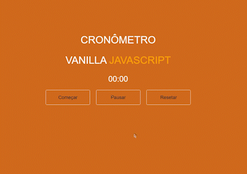
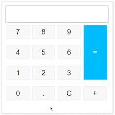

# Pequenos projetos utilizando JavaScript

## Intuito

Este repositório contém os pequenos projetos que desenvolvi durante o ano de 2022 <em>(para o próximo ano também serão adicionado novos projetos)</em>.

### Guia dos projetos

<table border="1">
   <tr>
     <td>
       <h4>00 - Cronômetro</h4>
       
      </td>
      <td>
        <h4>01 - Calculadora de hipotenusa</h4>
        
     </td>
    </tr>
 </table>

